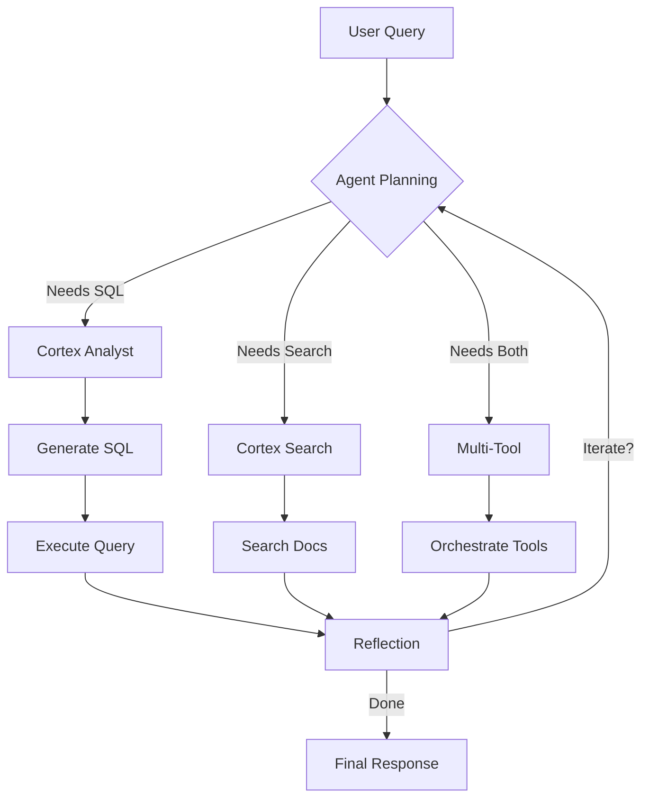

# Snowflake Cortex Intelligence Use Case

An intelligent sales assistant powered by Snowflake Cortex Agents with automatic multi-tool orchestration.

## 🎯 Key Features

- ✅ **Automatic Multi-Tool Orchestration** - Handles compound queries across structured and unstructured data
- 🔍 **Cortex Search** - Retrieves policies, documentation, and unstructured information
- 📊 **Cortex Analyst** - Generates SQL queries and analyzes structured sales data
- 💬 **Conversation Context** - Maintains conversation history using threads
- 🎨 **Modern UI** - Built with Streamlit in Snowflake (SiS)
- 🔒 **Enterprise Security** - RBAC, audit logging, and governed data access

## 📁 Project Structure

```
├── Streamlit_agent.py          # ✅ Production app (pre-configured agent)
├── Streamlit.py                # POC app (client-side orchestration)
├── CORTEX_AGENT_SALES.yaml     # Semantic model for Cortex Analyst
├── Snowflake_Tables.sql        # Database schema and sample data
├── Cortex_Search_Queries.sql   # Cortex Search service setup
└── docs/
    ├── ARCHITECTURE.md         # Detailed architecture & design decisions
    ├── IMPLEMENTATION_NOTES.md # Technical implementation guide
    ├── USAGE_GUIDE.md          # User guide and examples
    └── LANGGRAPH_DISCUSSION.md # Future enhancements discussion
```

## 🚀 Quick Start

### Prerequisites

- Snowflake account with Cortex features enabled
- `CORTEX_USER` or `CORTEX_AGENT_USER` role
- Access to create agents, search services, and semantic models

### Setup

1. **Create Database Objects**
   ```sql
   -- Run Snowflake_Tables.sql to create schema and sample data
   ```

2. **Set up Cortex Search**
   ```sql
   -- Run Cortex_Search_Queries.sql to create search service
   -- Upload sample PDFs to stage
   ```

3. **Create Semantic Model**
   - Upload `CORTEX_AGENT_SALES.yaml` to Snowflake stage
   - Configure Cortex Analyst to use the semantic model

4. **Create Pre-configured Agent**
   ```sql
   CREATE AGENT CORTEX_SALES_AGENT
   IN SCHEMA SNOWFLAKE_INTELLIGENCE.AGENTS
   WITH 
       DISPLAY_NAME = 'Sales Intelligence Agent',
       DESCRIPTION = 'Answers questions about sales data and policies';
   
   -- Add Cortex Analyst tool
   ALTER AGENT CORTEX_SALES_AGENT
   ADD TOOL cortex_analyst_semantic_view(
       NAME => 'Cortex Sales Analyst',
       SEMANTIC_VIEW => 'CORTEX_AGENTS.CORTEX_AGENTS_SALES.SEMANTIC_MODEL',
       WAREHOUSE => 'YOUR_WAREHOUSE'
   );
   
   -- Add Cortex Search tool
   ALTER AGENT CORTEX_SALES_AGENT
   ADD TOOL cortex_search_service(
       NAME => 'Cortex-Sales-Search',
       SERVICE => 'CORTEX_AGENTS.CORTEX_AGENTS_SALES.DOCS'
   );
   ```

5. **Deploy Streamlit App**
   - Open Snowsight
   - Create new Streamlit app
   - Paste contents of `Streamlit_agent.py`
   - Run the app!

## 💡 Usage Examples

### Simple Queries

**Structured Data:**
> "What are the top 5 products by revenue?"

**Unstructured Data:**
> "What is the refund policy?"

### Compound Queries (Multi-Tool)

**The magic of pre-configured agents!**

> "Show me the top 3 distributors by revenue and explain the return policy"

The agent automatically:
1. ✅ Recognizes this needs BOTH tools
2. ✅ Generates SQL for distributor analysis
3. ✅ Searches documentation for return policy
4. ✅ Combines results into coherent response with citations

> "What were sales in Q1 2024 and how long does shipping take?"

> "List orders over $10,000 and what's the warranty policy?"

### Conversation Context

With threads enabled (default):
```
User: "What are the top distributors?"
Agent: [Shows distributor list from SQL query]

User: "What's the revenue for the first one?"
Agent: [Understands context, queries specific distributor]

User: "Do they have any contract terms?"
Agent: [Searches for contract information]
```

## 🔧 Configuration

### Debug Mode

Enable in sidebar to see:
- Raw API responses
- Individual SSE events
- Tool calls and execution
- Thread and message IDs
- Performance metrics

### Model Selection

Choose orchestration model:
- `claude-sonnet-4-5` (recommended)
- `claude-3-7-sonnet`
- `claude-3-5-sonnet`

### Thread Support

Toggle "Use Conversation Context":
- **ON** (default): Server maintains conversation history
- **OFF**: Each query is independent

## 🏗️ Architecture

### Two Approaches Compared

| Feature | Pre-configured Agent | Client-side Orchestration |
|---------|---------------------|---------------------------|
| File | `Streamlit_agent.py` | `Streamlit.py` |
| Multi-tool | ✅ Automatic | ⚠️ Manual required |
| Complexity | Simple | Complex |
| Thread Support | ✅ Yes | ❌ No |
| Best For | Production | POC/Learning |

**Key Discovery:** Pre-configured agents handle multi-tool orchestration automatically, while ad-hoc agents require client-side orchestration logic.

See [`docs/ARCHITECTURE.md`](docs/ARCHITECTURE.md) for detailed analysis.

## 📊 How It Works

### Pre-configured Agent Workflow



### Response Processing

1. **SSE Streaming**: Agent sends Server-Sent Events
2. **Event Types**:
   - `thinking` - Agent's reasoning process
   - `tool_use` - Tool invocation
   - `tool_result` - Tool execution results
   - `text` - Final response text
   - `metadata` - Thread and message IDs
3. **Citation Extraction**: Annotations linked to source documents
4. **SQL Display**: Generated queries shown for transparency

## 🔐 Security

### Access Control

```sql
-- Grant agent usage
GRANT USAGE ON AGENT CORTEX_SALES_AGENT TO ROLE sales_team;

-- Grant tool access
GRANT USAGE ON CORTEX SEARCH SERVICE docs TO ROLE sales_team;
GRANT USAGE ON SEMANTIC MODEL semantic_model TO ROLE sales_team;
```

### Data Governance

- Row-level security via semantic model
- Column-level masking for sensitive fields
- Audit logging of all agent interactions

## 📈 Performance

- **Simple Query**: ~1-2 seconds
- **Compound Query**: ~3-5 seconds (multiple tools)
- **With Thread**: Faster context retrieval
- **Streaming**: Real-time token-by-token display

## 🐛 Troubleshooting

### Agent Returns Empty Response

**Symptom**: 200 OK but no text output

**Solution**: Check response format (we fixed this!)
- Pre-configured agents use `"response"` event
- Ad-hoc agents use `"message.delta"` event

### Multi-Tool Not Working

**Issue**: Agent only calls one tool for compound queries

**Solution**: 
- ✅ Use pre-configured agent (automatic)
- ⚠️ Ad-hoc agent requires client-side orchestration

### Thread Not Creating

**Check**:
```sql
-- Verify permissions
SHOW GRANTS TO ROLE your_role;

-- Should see CORTEX_USER or CORTEX_AGENT_USER
```

## 📚 Documentation

- [`ARCHITECTURE.md`](docs/ARCHITECTURE.md) - Design decisions and comparisons
- [`IMPLEMENTATION_NOTES.md`](docs/IMPLEMENTATION_NOTES.md) - Technical details
- [`USAGE_GUIDE.md`](docs/USAGE_GUIDE.md) - User guide and examples
- [`LANGGRAPH_DISCUSSION.md`](docs/LANGGRAPH_DISCUSSION.md) - Advanced workflows

## 🎓 Learning Points

### Multi-Tool Orchestration Discovery

Through this project, we discovered:

1. **Pre-configured agents** have intelligent LLM-based orchestration
2. **Ad-hoc agents** require manual orchestration for compound queries
3. Response formats differ significantly between approaches
4. Thread support enables stateful conversations

### Journey

```
❌ Ad-hoc agent (single tool only)
  ↓
✅ Client-side orchestration (manual, but works)
  ↓
✅✅ Pre-configured agent (automatic multi-tool!)
```

## 🚀 Future Enhancements

- [ ] Add more tools (custom UDFs, external APIs)
- [ ] Implement feedback collection
- [ ] Add chart generation from Cortex Analyst
- [ ] LangGraph for complex workflows (3+ tools)
- [ ] Multi-modal support (images, documents)
- [ ] A/B testing different models
- [ ] Performance monitoring dashboard

## 🤝 Contributing

This is a reference implementation. Feel free to:
- Adapt for your use case
- Add more tools
- Enhance UI/UX
- Share learnings!

## 📝 License

MIT License - See LICENSE file

## 🙏 Acknowledgments

- Snowflake Cortex team for excellent documentation
- Community discussions on multi-tool orchestration
- Claude for helping debug the response format issue!

---

**Questions?** Check the [documentation](docs/) or review the [architecture guide](docs/ARCHITECTURE.md).

**Getting Started?** Begin with `Streamlit_agent.py` - it's production-ready!
